# 7Even — Магазин продуктов


Android‑приложение на Kotlin и Jetpack Compose с каталогом, поиском и адаптацией под тёмную тему.

## Основные возможности

- **Каталог продуктов**: сетка товаров, категории, скидки, быстрые действия
- **Умный поиск**: Unicode‑поиск (русский ввод), дебаунс, релевантная сортировка
- **Детали товара**: фото с кроссфейдом, скидка‑бейдж, шаринг карточки
- **Корзина**: счётчик в тулбаре, управление количеством, подсчёт итогов
- **Избранное**: экран избранных товаров, добавление из карточки
- **Акции**: отдельный экран «Акции», бейдж количества в меню
- **Настройки**: выбор темы (Системная / Светлая / Тёмная) с мини‑превью
- **Тёмная тема**: улучшенная палитра M3, onSurface/Variant, error‑контейнеры
- **Навигация**: компактное overflow‑меню (сортировка, акции, избранное, настройки)
- **Полировка UI/UX**: хаптика и микропружины на действия, шимер‑плейсхолдеры

## Технологии

- **Kotlin** - Основной язык программирования
- **Jetpack Compose** - Современный UI toolkit
- **Material Design 3** - Дизайн система
- **Navigation Compose** - Навигация между экранами
- **ViewModel** - Управление состоянием
- **StateFlow** - Реактивные потоки данных
- **Coil** - Загрузка изображений
- **Accompanist Placeholder** - Шимер‑плейсхолдеры (легаси)
- **Material 3** - Тема/палитра, SearchBar, BadgedBox, Overflow menu

## Экраны приложения

### 1. Каталог
Главная страница приложения с каталогом продуктов:

- **Верхняя панель**: Логотип "7Even" (кликабельный для возврата на главный экран), иконки поиска, меню и корзины
- **Фильтры категорий**: Горизонтальная прокрутка категорий (Все, Фрукты, Овощи, Молочные продукты и др.)
- **Сетка товаров**: Двухколоночная сетка с карточками продуктов:
  - Изображение продукта с иконкой избранного
  - Название продукта на русском языке
  - Цена в рублях (₽)
  - Бейдж скидки для товаров со скидкой (например, "-15%")
  - Кнопка "В корзину" для добавления товара
- **Продукты**: Апельсины, Бананы, Йогурт натуральный, Картофель, Круассан, Куриная грудка (со скидкой) и другие
- **DockedSearchBar**: Строка поиска с русской раскладкой и анимациями
- **Сортировка**: Доступна через overflow‑меню (имя / цена / скидка)
- **Анимации**: Плавные переходы и современные эффекты (shared element transitions, parallax scroll)

Скриншоты:

<p align="center">
  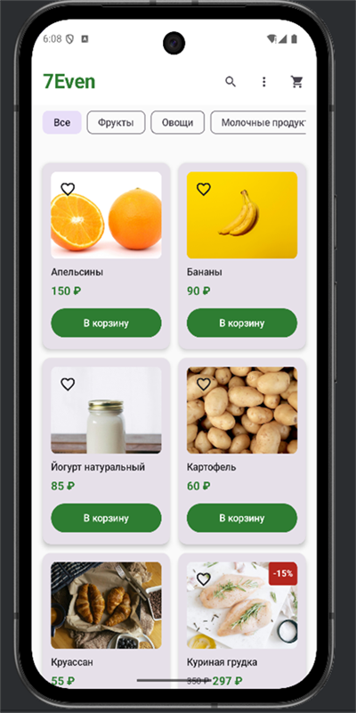
  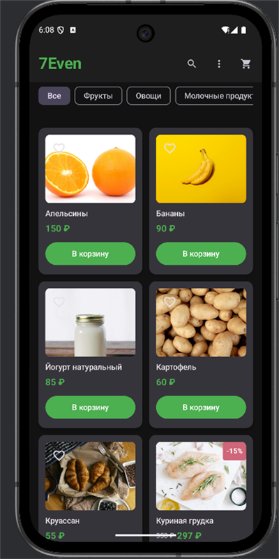
</p>

### 2. Детали товара
- Большое фото (Coil, crossfade), шимер при загрузке
- Бейдж скидки, описание, выбор количества
- Кнопка «Поделиться» (стандартный системный диалог)

Скриншоты:

<p align="center">
  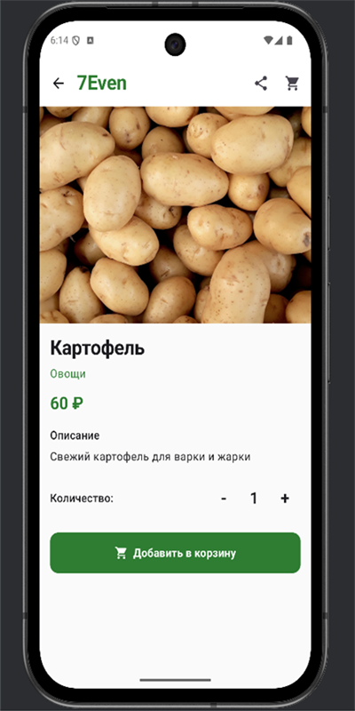
  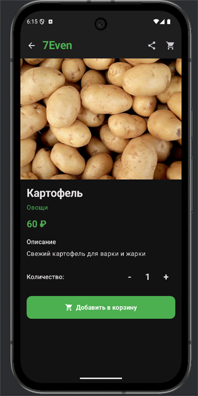
</p>

### 3. Корзина
- Список товаров, управление количеством
- Итоговая стоимость, быстрый переход из тулбара

Скриншоты:

<p align="center">
  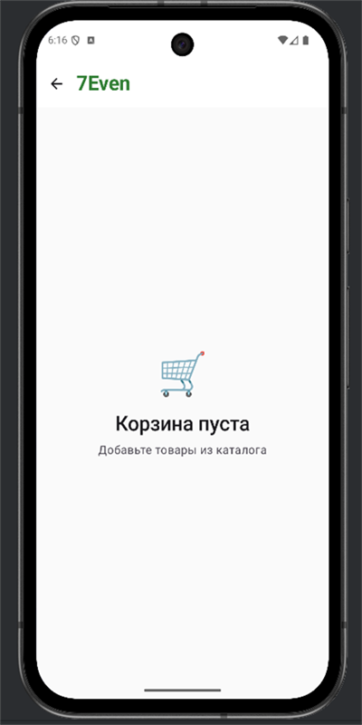
  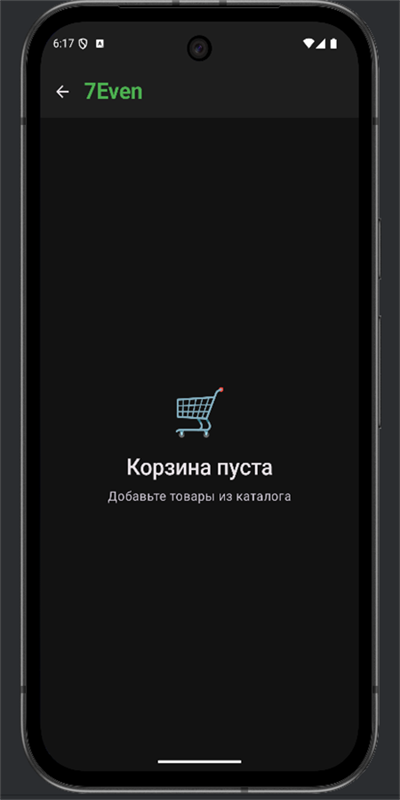
</p>

### 4. Избранное
- Список избранных товаров, очистка

Скриншоты:

<p align="center">
  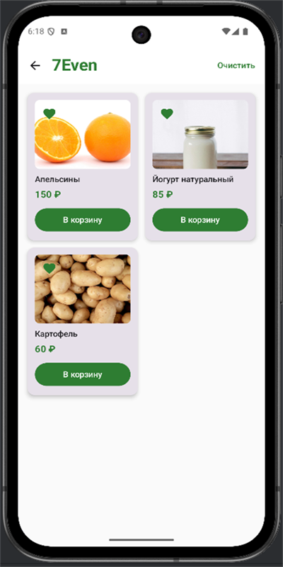
  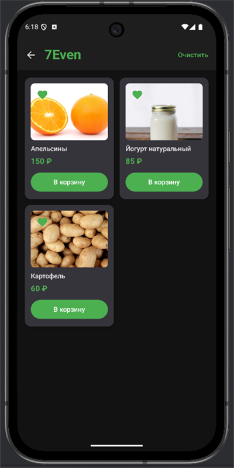
</p>

### 5. Акции
- Все товары со скидками, сортировка по размеру скидки

Скриншоты:

<p align="center">
  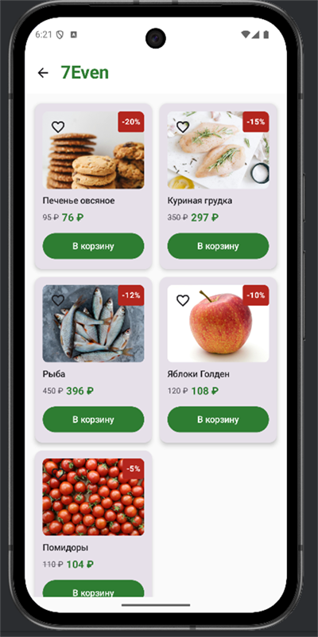
  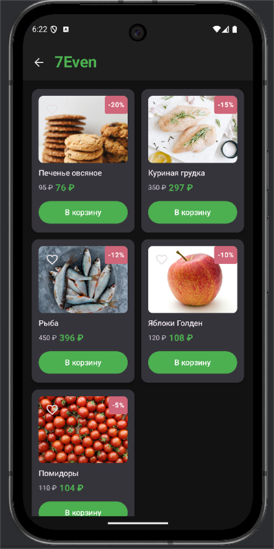
</p>

### 6. Настройки
- Переключение темы (Системная / Светлая / Тёмная) + мини‑превью

Скриншоты:

<p align="center">
  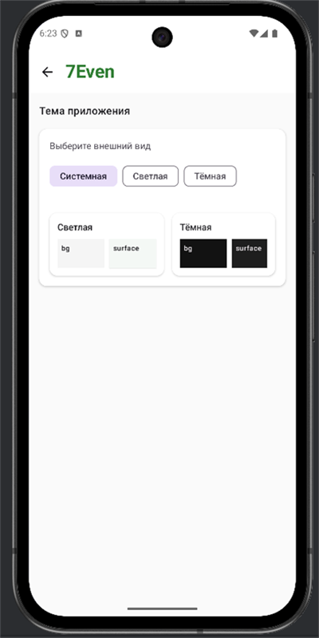
  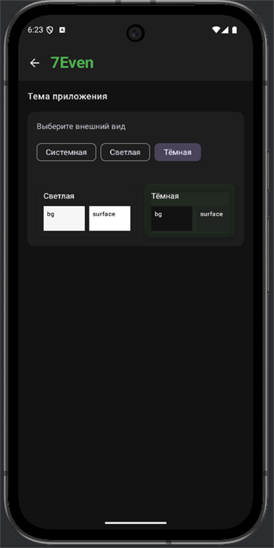
</p>

## Дизайн

Material Design 3 + кастомные схемы для светлой/тёмной темы:
- Улучшенные `onBackground`, `onSurface`, `surfaceVariant`, `onSurfaceVariant`
- Контейнеры ошибок `errorContainer`, `onErrorContainer`

## Структура проекта

```
app/src/main/java/com/example/product_store/
├── data/
│   ├── Product.kt                 # Модель продукта
│   └── CartItem.kt                # Модель корзины
├── navigation/
│   └── ProductStoreNavigation.kt  # Навигация
├── ui/
│   ├── screens/
│   │   ├── ProductCatalogScreen.kt    # Каталог
│   │   ├── ProductDetailScreen.kt     # Детали
│   │   ├── CartScreen.kt              # Корзина
│   │   ├── FavoritesScreen.kt         # Избранное
│   │   ├── SettingsScreen.kt          # Настройки (тема с превью)
│   │   └── DealsScreen.kt             # Акции
│   └── theme/
│       ├── Color.kt                   # Цвета
│       ├── Theme.kt                   # Тема
│       └── Type.kt                    # Типографика
├── viewmodel/
│   └── ProductStoreViewModel.kt      # ViewModel
└── MainActivity.kt                    # Главная активность
```

## Запуск

1. Откройте проект в Android Studio
2. Sync Gradle
3. Запустите на эмуляторе/устройстве из IDE
   или из консоли:

   ```bash
   ./gradlew installDebug
   ```

## Требования

- Android API 35+
- Kotlin 2.0.21+
- Jetpack Compose
- Android Studio Arctic Fox или новее
---
